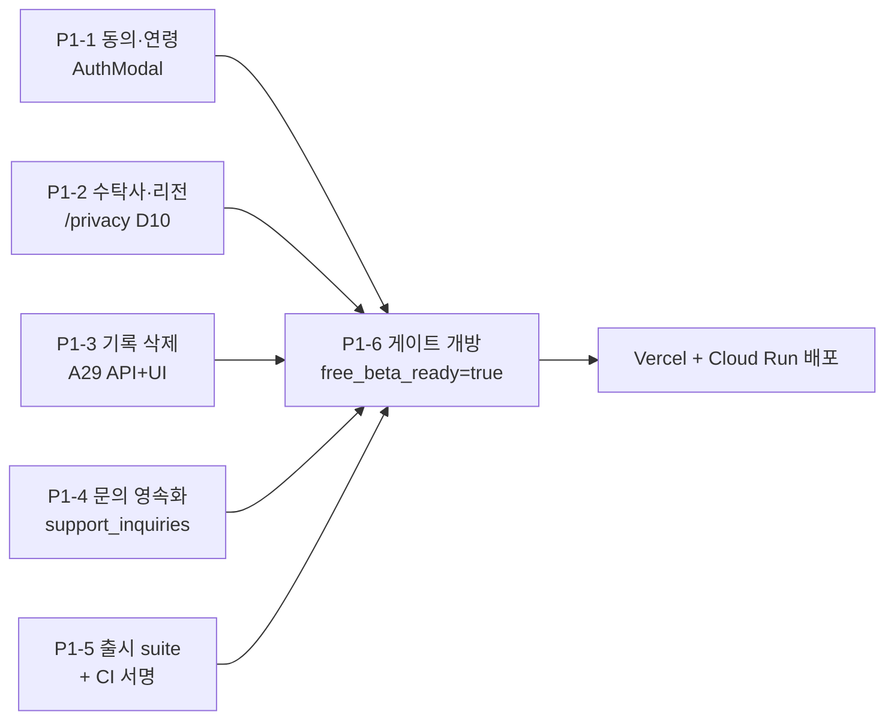
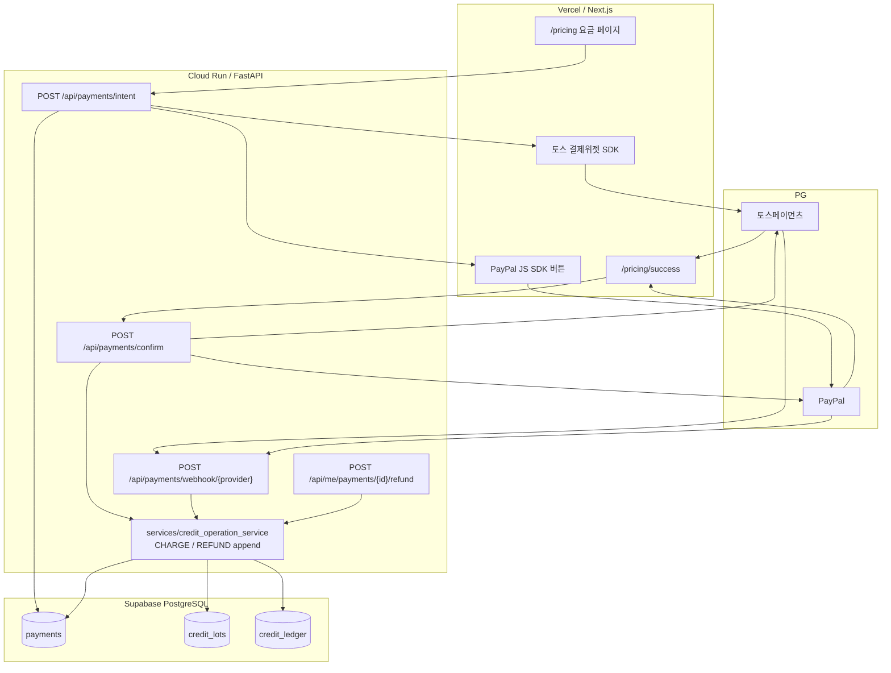

# 무료 베타 → 유료화 2단계 실행 지시서

작성: 2026-09-12 · 기준 SHA: `0f2d120` (`claude/cycle-06-central-integration` 팁)
선행 지시: 2026-09-12 운영자 방향 전환 결정 (48개 전수 검수 루프 종료)

이 문서는 `PROJECT_CONTROL.md`의 CYCLE 보드를 **대체하지 않고 앞에 선다.** 앞으로의
작업은 여기 적힌 Phase 1 / Phase 2 카드로만 배정한다. 기존 CYCLE 기록은 이미 끝난
일의 이력으로 남긴다(4절 참고).

---

## 0. 지시서와 저장소의 실제 상태 차이 — 먼저 읽을 것

작업 지시서를 저장소 코드와 대조한 결과 다섯 군데가 어긋난다. 계획을 세우기 전에
이것부터 맞춰야 일정이 맞는다.

| # | 지시서 서술 | 저장소 실제 | 영향 |
|---|---|---|---|
| 1 | `core/credit_ledger.py` 원장에 `CHARGE` append | 그런 파일은 없다. 원장 로직은 `services/credit_service.py`(기본 연산)와 `services/credit_operation_service.py`(예약·멱등·복구), 테이블은 `credit_ledger` | 경로만 바뀜. 설계는 그대로 유효 |
| 2 | "`policy_documents_draft: false`, `free_beta_ready: true` 설정 후 게이트 개방" | 이 둘은 **설정값이 아니라 계산 결과**다(`core/release_gate.py:public_service_config`). 게이트를 열려면 D 결정 10건 + 정책 문서 버전·게시 + 승인자·승인일 + **서명된 인수증거 manifest**가 필요하다 | **Phase 1의 진짜 임계 경로.** 3.5절 참고 |
| 3 | 프런트 4가지만 보완하면 게이트 개방 | 현재 코드에서는 **어떤 설정으로도 게이트가 열리지 않는다.** `RELEASE_ELIGIBLE_SUITE_VERSIONS`(빈 frozenset)와 `APPROVED_ACCEPTANCE_PUBLIC_KEYS`(빈 튜플)가 fail-closed로 고정돼 있다 | 프런트 4건 + **출시 suite 정의·CI 서명 1건**이 Phase 1이다 |
| 4 | 상담 기록 삭제 UI 연결 (A29) | 백엔드 엔드포인트가 **없다.** 다만 `notes/claude/CYCLE-09-DATA-RIGHTS-DESIGN.md`에 계약 설계가 이미 완성돼 있고 운영자 승인만 대기 중이다 | 설계 재작업 불필요. D03 미결 4건만 결정하면 착수 가능 |
| 5 | 환불 = 잔여 유료 크레딧 비례 | 스키마에 **유료/무료 크레딧 구분이 없다.** `profiles.credit_balance`는 정수 하나, `credit_ledger.event_type`은 `WELCOME/DEBIT/RELEASE` 뿐 | Phase 2에 **크레딧 lot 분리 migration**이 선행 과제로 추가됨. 3.2절 |

추가로: 이 브랜치는 작업 시작 시 `main`(`cea8858`, 2026-09-07)에 있었고 최신 통합
결과보다 33커밋 뒤처져 있었다. `claude/cycle-06-central-integration`(`0f2d120`)으로
fast-forward했다. 이 문서의 모든 파일 경로·행 번호는 그 SHA 기준이다.

---

## 1. Phase 1 — 무료 베타 공개

### 1.0 전체 그림



P1-1 ~ P1-5는 서로 독립이라 병렬로 진행할 수 있다. P1-6은 다섯 개가 전부 끝나야
의미가 있다.

### 1.1 P1-1 · 법적 동의 및 연령 확인 (A19 / A21 / A22 / A24)

**대상 파일**

| 파일 | 변경 |
|---|---|
| `frontend/src/components/auth/AuthModal.tsx` | 체크박스 2개 추가, 미체크 시 로그인 차단 |
| `frontend/src/context/AuthContext.tsx:94` | `signInWithGoogle()`에 동의 스냅샷 인자 추가 |
| `frontend/src/lib/api.ts` | `postConsentApi()` 추가 |
| `api/routers/consent.py` *(신규)* | `POST /api/me/consent`, `GET /api/me/consent` |
| `core/models/counsel.py` | `UserConsent` 모델 추가 |
| `migrations/versions/<new>` | `user_consents` 테이블 + RLS (`down_revision = "e8b72c4a91d0"`) |

**핀포인트 수정**

`AuthModal.tsx:100`의 문구 — "로그인 시 서비스 이용약관 및 개인정보 처리방침에
동의하게 됩니다" — 는 **묵시적 동의**다. 이것을 지우고 `AuthModal.tsx:82~99`
(Google 버튼 블록) 위에 체크박스 두 개를 넣는다.

```
[ ] (필수) 만 19세 이상입니다.                               → ageConfirmed
[ ] (필수) 이용약관 및 개인정보처리방침에 동의합니다.          → termsAgreed
     └ /terms, /privacy 로 각각 새 탭 링크 (이미 존재하는 페이지)
```

`AuthModal.tsx:85`의 `onClick={signInWithGoogle}`는
`disabled={!(ageConfirmed && termsAgreed)}`를 함께 건다. `disabled`만으로는 부족하다 —
버튼을 DOM에서 조작해 우회할 수 있으므로 핸들러 진입부에서도 한 번 더 막는다(A21).

**서버에 기록하지 않으면 동의는 증거가 아니다**

체크박스만 만들면 A19는 화면 문구가 되고 A21·A22·A23(철회·버전 변경)은 계속
NOT_RUN이다. 최소 계약:

```
POST /api/me/consent      인증 필요, 게이트 무관
body: { "terms_version": "2026-09-12", "privacy_version": "2026-09-12",
        "age_confirmed": true }
201:  { "recorded_at": "...", "terms_version": "...", "privacy_version": "..." }
409:  이미 같은 버전으로 기록됨 (멱등)
```

`user_consents`는 append-only로 둔다(동의·철회·버전 변경 이력이 남아야 A23이 성립).
로그인 직후 클라이언트가 1회 호출하고, 실패하면 상담 진입을 막는다.

**D02 제약을 지킬 것**: 운영자 결정표 D02는 "체크박스가 법적 본인확인을 대체한다고
주장 금지"다. 화면 문구와 `/terms`에 "본인확인 절차가 아니라 이용자 확인"임을 명시한다.

**검증**: `tests/e2e/scenarios_a_items.py`에 A21(미동의 차단), A22(선택 동의 분리),
A24(연령 미확인 차단) 시나리오 추가. FE는 `frontend/src/lib/__tests__/`에 단위 테스트.

### 1.2 P1-2 · 수탁사 및 리전 확정 (D10 / A27)

**운영자 결정 (2026-09-12)**: 백엔드 자원이 Google Cloud Run · Supabase · Vercel이므로
리전을 한국으로 옮기는 대신 **국외 이전 사실을 그대로 고지한다.** 코드의 리전 설정
(`GEMINI_LOCATION=us-central1`, `CLAUDE_LOCATION=us-east5`,
`LLM_ALLOWED_REGIONS=us-central1,us-east5`)은 **변경하지 않는다.**

**대상 파일**: `frontend/src/app/privacy/page.tsx:105~127` (3절 위탁 표) + 국외 이전
고지 섹션 신설

현재 세 행 모두 리전 칸이 `확인 중 (미확정)`이다. 콘솔 실측값으로 바꾼다.
`README.md:92~103`의 "서울 리전" 서술은 **문서의 주장이지 증거가 아니다.**

| 수탁 업체 | 위탁 업무 | 리전 확인 |
|---|---|---|
| Supabase Inc. | 인증 세션·암호화 DB 호스팅 | 대시보드 실측 (README는 `ap-northeast-2` 주장) |
| Google Cloud (Vertex AI) | 괘·주석 기반 성찰 대화 추론 | **미국** `us-central1` / `us-east5` — 코드로 확정. **모델 학습 미사용(ZDR)** 명시 |
| Vercel Inc. | 웹 서비스 호스팅 | 콘솔 실측. `frontend/vercel.json`에 `regions` 키가 없다 |

국외 이전 고지에는 법정 기재사항 5개(이전 항목 / 국가·일시·방법 / 이전받는 자 /
목적·기간 / 거부 방법과 효과)가 전부 들어가야 한다. 수탁사별로 이전 항목이 다르므로
한 덩어리로 뭉뚱그리지 않는다. 상세는 작업 지시서 4.3절.

**별도 동의 대신 처리방침 공개로 갈음**하는 것을 전제로 설계한다. 이 전제가 법률
검토에서 뒤집히면 P1-1의 체크박스가 하나 늘어난다.

**같이 고쳐야 할 것 — 놓치기 쉬움**

1. `privacy/page.tsx:12` `badgeText="정책 검토안 (DRAFT v0.1)"` → 확정본 버전으로.
   `terms`·`refund`·`ai-notice`·`licenses`·`safety`·`contact` 페이지의 `LegalHeader`
   badge도 같은 버전 문자열로 통일한다. 이 문자열이 P1-6의 `LEGAL_DOCUMENTS_VERSION`
   (`YYYY-MM-DD` 형식)과 **일치해야 한다.**
2. `privacy/page.tsx:17~27` DRAFT 배너 제거.
3. 방침에 적은 리전과 `core/config.py` 실제 값을 사람이 대조한다. 게이트의
   `check_config_consistency`는 allowlist만 검사하고 **방침 문서와의 일치는 검사하지
   않는다.**
4. 데이터센터가 서울이어도 **수탁사가 국외 법인이면** 국외 이전에 해당하는지는 별도
   법률 판단이다(국외 접근 권한 문제). 코딩 에이전트가 결론을 쓰지 않는다.

### 1.3 P1-3 · 상담 기록 열람·삭제 (A29)

**이미 설계가 있다.** `docs/commercialization/notes/claude/CYCLE-09-DATA-RIGHTS-DESIGN.md`
가 엔드포인트 4개, 삭제 SQL, 하네스 시나리오 10건까지 확정해 뒀다. 재설계하지 않는다.

**착수 전 운영자 결정 4건** (설계서 4절):

| # | 결정 | 권고 |
|---|---|---|
| 1 | 내보내기에 크레딧 원장 포함? | 제외 |
| 2 | `evidences`·`focus_rule` 내부 근거 포함? | 요약만 |
| 3 | 삭제 = 즉시 파기 / 90일 유예? | 즉시 (되돌릴 수 없음) |
| 4 | 내보내기 동기 / 비동기? | 동기 + 세션 500 상한, 초과 시 202 |

**Phase 1 범위 축소 제안**: A30(내보내기)은 Phase 1에서 빼고 `GET /api/me/records`,
`GET /api/me/records/{id}`, `DELETE /api/me/records/{id}` 셋만 낸다. 삭제 UI를 여는 데
내보내기는 필요 없고, 결정 #1·#2·#4가 전부 내보내기에만 걸린다. 그러면 **결정 #3
하나만으로 착수**할 수 있다.

**백엔드 핀포인트**

| 파일 | 변경 |
|---|---|
| `api/routers/records.py` *(신규)* | 3개 엔드포인트. 의존성은 `check_rate_limit` + `require_user` **둘뿐** — `require_service_gate`를 걸지 않는다 |
| `api/main.py:185` 다음 | `app.include_router(records.router)` 1줄 |

삭제 계약의 핵심 두 가지(설계서 5절에서 그대로 가져옴):

```sql
-- 소유권을 DELETE 문 자체에 넣는다. SELECT 후 DELETE는 경합이 생긴다.
DELETE FROM counsel_sessions WHERE id = :sid AND user_id = :sub;
-- turns·journal은 FK CASCADE가 함께 지운다.
```

```sql
-- 상담 본문이 credit_operations.response_snapshot에 복제돼 있다.
-- 행은 남기고(원장·멱등 판정이 참조) 본문만 지운다.
UPDATE credit_operations SET response_snapshot = NULL
 WHERE user_id = :sub AND <해당 session 참조>;
```

두 번째를 빠뜨리면 "삭제했다"고 응답하고 본문이 남는다. 이것이 A29 검증의 핵심
시나리오(A29-6)다.

**프런트 핀포인트**

`JournalSummaryCard.tsx`는 현재 `sessionId`를 **받지 않는다**(props: `journal`,
`onRestart`, `className`). 두 곳을 고친다.

| 위치 | 변경 |
|---|---|
| `frontend/src/app/page.tsx:639` | `<JournalSummaryCard journal={journal} sessionId={sessionId} onRestart={handleRestart} />` |
| `JournalSummaryCard.tsx:21~30` | props에 `sessionId: string` 추가 |
| `JournalSummaryCard.tsx:249~272` (버튼 행) | `[이 상담 기록 삭제]` 버튼 추가 |
| `frontend/src/lib/api.ts` | `deleteRecordApi(sessionId)` 추가 |

삭제는 되돌릴 수 없으므로 확인 모달을 반드시 끼운다. 삭제 성공 시 `page.tsx:280`의
`handleRestart` 경로를 재사용해 초기 화면으로 되돌린다.

`/contact`의 "개인정보 열람·삭제·동의철회" 문의 유형과 중복되지 않게, contact 페이지
안내문에 "상담 기록은 상담 완료 화면에서 직접 삭제할 수 있습니다" 링크를 추가한다.

### 1.4 P1-4 · 고객지원 문의 영속화 (A20)

**현재**: `frontend/src/app/contact/page.tsx:25~29`가 `setTimeout` 600ms 후
`Math.random()`으로 티켓 번호를 만든다. 아무것도 저장하지 않는다.

**대상 파일**

| 파일 | 변경 |
|---|---|
| `api/routers/support.py` *(신규)* | `POST /api/support/inquiries` |
| `core/models/counsel.py` | `SupportInquiry` 모델 |
| `migrations/versions/<new>` | `support_inquiries` + RLS |
| `contact/page.tsx:19~31` | `handleSubmit`을 실제 API 호출로 교체 |
| `contact/page.tsx:45~55, 159` | "모의 접수" 문구 제거 |
| `frontend/src/lib/api.ts` | `submitSupportInquiryApi()` |

**테이블**

```
support_inquiries
  id            uuid pk
  ticket_no     text unique       -- 서버 생성. 날짜 + 랜덤, 추측 불가해야 함
  user_id       uuid null         -- 로그인 상태면 채운다. FK profiles, ON DELETE SET NULL
  category      text              -- service|refund|privacy|safety|other (서버 allowlist 검증)
  email         text              -- 개인정보. D03 수집 항목에 추가 고지 필요
  order_id      text null
  message       text              -- 길이 상한 (예: 4000자)
  status        text default 'RECEIVED'
  created_at    timestamptz
```

**결정이 필요한 것 하나**: 비로그인 접수를 허용하는가.

- 허용하면 — 탈퇴자·로그인 불가자가 문의할 수 있다(A20의 취지). 대신 스팸 방어가
  필요하다. IP 기준 `check_rate_limit`만으로는 약하다.
- 불허하면 — 구현이 간단하고 `require_user`로 끝난다. 대신 "로그인이 안 되는데
  문의도 못 한다"가 된다.

**권고**: 허용하되 ① IP+이메일 기준 시간당 상한, ② 본문 길이 상한, ③ 카테고리
allowlist, ④ 이메일 형식 서버 검증을 건다. 데이터 권리 요청(A29 경로) 접수 창구를
로그인 뒤에 두면 안 되는 것과 같은 이유다.

**RLS**: `support_inquiries`는 클라이언트가 직접 읽지 않는다. `e8b72c4a91d0`이
`credit_operations`에 건 것과 같은 패턴(anon/authenticated 전면 deny, 서버 역할만)을
그대로 적용한다. 문의 본문에 타인 개인정보가 섞여 들어올 수 있으므로 열람 경로를
만들지 않는 것이 안전하다.

**"이메일을 새로 수집한다"** — `privacy/page.tsx`의 D03 수집 항목 표에 고객지원
문의 항목을 추가해야 한다. P1-2와 같은 커밋에서 처리한다.

### 1.5 P1-5 · 출시 suite 정의와 CI 서명 — Phase 1의 임계 경로

이것이 실제로 가장 오래 걸리는 항목이다. 지시서에는 없지만 **이것 없이는 게이트가
열리지 않는다.**

`core/release_gate.py:check_free_beta_evidence`가 요구하는 것:

| 요구 | 현재 값 | 누가 채우나 |
|---|---|---|
| `OPERATOR_ATTESTED_DECISIONS` ⊇ D01·D02·D03·D04·D05·D06·D10·D11·D12·D13 | 빈 문자열 | 운영자 |
| `LEGAL_DOCUMENTS_VERSION` = `YYYY-MM-DD` | 빈 문자열 | 운영자 (P1-2와 동일 값) |
| `LEGAL_DOCUMENTS_PUBLISHED` = true | false | 운영자 |
| `FREE_BETA_LAUNCH_APPROVED_BY` / `_AT` | 빈 문자열 | 운영자 |
| `ACCEPTANCE_EVIDENCE_SHA` (40 hex) + `_SUITE_VERSION` | 빈 문자열 | CI |
| `ACCEPTANCE_MANIFEST_PATH`의 **서명된 manifest** | 없음 | CI |
| `release_trust.APPROVED_ACCEPTANCE_PUBLIC_KEYS` ≠ () | `()` — 빈 튜플 | 운영자 승인 + 코드 리뷰 |
| manifest의 `suite_version` ∈ `RELEASE_ELIGIBLE_SUITE_VERSIONS` | `frozenset()` — 비어 있음 | 코드 리뷰 |

즉 **설정만 바꿔서는 절대 열리지 않도록 설계돼 있다.** 이것은 결함이 아니라
`core/release_trust.py` 문서에 적힌 의도다. 열려면 절차를 밟아야 한다.

**실행 순서**

1. **무료 베타 출시 suite를 정의한다.** 이름 예: `free-beta/v1`. 내용은 A01~A48 전체가
   아니라 무료 베타에 실제로 걸리는 부분집합이다 (4절의 TEST_MATRIX 간소화와 같은
   작업이다). 최소 후보: A01, A04, A05, A06, A08, A09, A10, A11~A17, A19, A21, A22,
   A24, A29, A34, A35, A36, A37. 결제 계열(A38~A44)은 Phase 2로 넘긴다.
2. `core/release_evidence.py`의 `KNOWN_SUITE_VERSIONS`와
   `RELEASE_ELIGIBLE_SUITE_VERSIONS`에 그 이름을 추가한다 (코드 리뷰 필요).
3. `REQUIRED_CHECKS`(현재 `release_gate`, `auth_hardening`, `card_export`)를 suite
   내용에 맞게 확장한다.
4. CI에 Ed25519 서명 단계를 만든다. 비공개키는 CI 시크릿, 저장소에 두지 않는다.
   suite가 실제로 PASS한 커밋에만 서명한다.
5. 운영자가 공개키를 승인하고, 승인 기록을 남기고, `APPROVED_ACCEPTANCE_PUBLIC_KEYS`에
   리뷰를 거쳐 추가한다. **이 단계를 코딩 에이전트가 대신 수행하지 않는다**
   (`release_trust.py` 명시).
6. 그 커밋으로 이미지를 다시 빌드하고 `BUILD_GIT_SHA`를 주입한다
   (manifest의 `target_sha`와 일치해야 한다).

**분기 판단**: 이 절차 전체가 무료 베타 하나에 과하다고 판단되면, 대안은
"게이트 요구 수준을 낮추는 코드 변경"이다. 그건 **운영자 결정 사항**이고 이 문서가
대신 정하지 않는다. 다만 낮출 거라면 낮춘다는 사실을 `PROJECT_CONTROL.md`에
명시적으로 기록해야 한다 — 조용히 우회하면 지난 8개 주기의 기록이 전부 의미를 잃는다.

### 1.6 P1-6 · 게이트 개방과 배포

P1-1~P1-5가 끝난 뒤에만 수행한다. 순서가 중요하다.

1. `.env`(Cloud Run `env.production.yaml`)에 위 8개 값을 채운다.
2. `GET /api/public/release-gate`로 `free_beta_ready: true`를 **서버에서 확인**한다.
   프런트가 먼저 열리면 안 된다.
3. `GET /api/public/config`가 `policy_documents_draft: false`를 반환하는지 확인
   (이 값은 `not gate.free_beta_ready`로 파생된다 — 따로 설정하지 않는다).
4. 백엔드 Cloud Run 배포 → 프런트 Vercel 배포 순서. 프런트를 먼저 올리면 활성 UI가
   503을 부른다.
5. BLK-C06-05 해제: 게이트가 정상 경로로 열렸으므로 브라우저 start/turn·202 polling·
   비과금 release·멱등 복구를 실제 브라우저에서 재현한다. 이것이 A47 전체 PASS와
   A48의 선행 조건이다.

`SERVICE_STAGE`는 `free_beta`, `PURCHASE_ENABLED`는 `false` 그대로 둔다. free_beta
단계에서 `PURCHASE_ENABLED=true`는 `check_config_consistency`가 기동을 막는다.

---

## 2. Phase 2 — 토스페이먼츠 · 페이팔 결제

무료 베타 오픈 후, PG 가맹점 심사와 병행한다.

### 2.1 아키텍처



**설계 원칙 세 가지**

1. **금액은 서버가 정한다.** 클라이언트가 보내는 금액을 신뢰하지 않는다.
   `POST /api/payments/intent`가 상품 ID를 받아 서버 가격표로 주문을 만들고
   `order_id`와 금액을 돌려준다. 결제창에 들어가는 금액은 이 값이다.
2. **승인은 Confirm과 Webhook 두 경로로 들어온다.** 둘 다 같은 멱등 처리로 수렴해야
   한다. 사용자가 결제창을 닫아도 webhook으로 충전되고, webhook이 늦어도 confirm으로
   충전된다. 두 번 충전되면 안 된다.
3. **카드 정보는 서버에 오지 않는다.** 토스 결제위젯과 PayPal SDK가 PG 도메인에서
   직접 처리한다. 우리가 받는 것은 `paymentKey`/`orderID`와 승인 결과뿐이다(A37).

### 2.2 선행 과제 — 크레딧 lot 분리 (이것 없이는 환불식이 성립하지 않는다)

현재 스키마:

```
profiles.credit_balance  INTEGER        -- 정수 하나
credit_ledger.event_type WELCOME|DEBIT|RELEASE
```

`/refund` 페이지에 적힌 공식 `환급 = 실결제 × (남은 유료 크레딧 ÷ 구매한 유료 크레딧)`을
계산하려면 "남은 유료 크레딧"을 알아야 한다. 지금 스키마로는 알 수 없다.

**제안: `credit_lots` 테이블 추가**

```
credit_lots
  id               uuid pk
  user_id          uuid fk profiles
  kind             text        -- 'FREE' | 'PAID'
  payment_id       uuid null fk payments   -- PAID일 때만
  granted          integer     -- 지급 수량
  consumed         integer     -- 소비 수량 (단조 증가)
  refunded         integer     -- 환불로 회수한 수량
  unit_amount      numeric     -- PAID일 때 크레딧 1개당 실결제 금액
  currency         text        -- 'KRW' | 'USD'
  expires_at       timestamptz null
  created_at       timestamptz
```

- **소비 순서**: `FREE` lot 먼저, 그다음 `PAID` lot을 `created_at` 오름차순으로
  (`/refund` 페이지가 이미 이렇게 고지하고 있다).
- `profiles.credit_balance`는 **버리지 않는다.** lot 합계와 일치해야 하는 캐시로 두고,
  불일치를 잡는 정합성 테스트를 넣는다. 기존 잔액 조회 경로(`read_credit_state`)와
  RLS 정책을 그대로 재사용하기 위해서다.
- 기존 91행 원장과 3개 프로필은 전부 `FREE` lot 하나로 backfill한다.

**새 이벤트 타입**: `CHARGE`(+C, 결제 승인), `REFUND`(-C, 환불 회수).
`credit_ledger`의 partial unique 인덱스는 현재 `(operation_id, event_type)` 기준이다.
결제 계열은 `operation_id`가 NULL이므로 **`(payment_id, event_type)`에 대한 partial
unique 인덱스를 추가**해야 중복 충전이 DB에서 막힌다. 이것이 웹훅 멱등의 마지막 방어선이다.

### 2.3 엔드포인트 설계

| 메서드 | 경로 | 인증 | 설명 |
|---|---|---|---|
| `GET` | `/api/payments/products` | 없음 | 판매 상품 목록·가격. 서버 가격표가 유일한 출처 |
| `POST` | `/api/payments/intent` | 필요 | 주문 생성. `{product_id, provider}` → `{order_id, amount, currency, provider_params}`. `payments` 행을 `PENDING`으로 만든다 |
| `POST` | `/api/payments/confirm` | 필요 | 토스: `{order_id, payment_key, amount}` → 토스 승인 API 호출. PayPal: `{order_id}` → capture 호출. 성공 시 `CHARGE` append |
| `POST` | `/api/payments/webhook/toss` | **서명 검증** | 토스 웹훅. `require_user` 불가 — 서명으로 인증한다 |
| `POST` | `/api/payments/webhook/paypal` | **서명 검증** | PayPal 웹훅. `PAYMENT.CAPTURE.COMPLETED` / `.REFUNDED` |
| `GET` | `/api/me/payments` | 필요 | 본인 결제 내역 |
| `POST` | `/api/me/payments/{id}/refund` | 필요 | 환불 신청. 계산 후 PG 취소 API 호출 |

**핵심 계약 4가지**

1. **멱등키**: `confirm`은 `order_id`를, webhook은 `(provider, provider_event_id)`를
   멱등 단위로 쓴다. 두 경로 모두 최종적으로 `payments.id` 기준 `CHARGE` 1건으로
   수렴한다 — 2.2의 partial unique 인덱스가 이를 DB에서 보장한다.
2. **금액 대조**: 승인 응답의 금액이 `payments.amount`와 다르면 **충전하지 않고**
   즉시 취소 API를 호출한다. 클라이언트가 조작한 금액으로 결제창을 띄우는 공격을 막는다.
3. **웹훅 인증**: 토스는 요청 서명, PayPal은 `verify-webhook-signature`로 검증한다.
   검증 실패는 401이고 로그에 본문을 남기지 않는다. 웹훅 경로는 CORS 대상이 아니므로
   `api/main.py`의 allowed_origins와 무관하다.
4. **비밀키 경계**: 토스 시크릿 키·PayPal 클라이언트 시크릿은 **백엔드에만** 둔다.
   프런트에는 클라이언트 키/Client ID만 노출한다. `NEXT_PUBLIC_` 접두사를 시크릿에
   절대 붙이지 않는다.

### 2.4 환불

```
환급 금액 = Σ over PAID lots ( 잔여수량 × unit_amount )
잔여수량 = granted - consumed - refunded
```

- 7일 이내 전액 미사용 → 전액 취소 (`payments` 1건 전체 취소).
- 일부 사용 → lot 단위 부분 환불. 해당 lot의 `refunded`를 올리고
  `credit_ledger`에 `REFUND`(-C)를 append한 다음 PG 부분취소 API를 호출한다.
- **순서 주의**: DB 트랜잭션을 먼저 커밋하고 PG를 호출하면, PG 실패 시 크레딧만
  사라진다. 반대로 PG를 먼저 부르고 DB가 실패하면 돈만 나간다. 기존
  `credit_operation_service`의 예약/종결 패턴을 그대로 쓴다 — 환불 `PENDING` 예약 →
  PG 호출 → 원자적 종결(fencing token). 이미 만들어 둔 구조를 재사용하는 것이 이 설계의
  가장 큰 이점이다.
- 웰컴 크레딧·이벤트 보너스(`FREE` lot)는 환급 대상이 아니다(`/refund` 고지와 일치).

### 2.5 결제 단계 게이트

`core/release_gate.py`가 이미 유료화 경로를 막고 있다. Phase 2 완료 조건은 코드로
표현되어 있다.

| 항목 | 현재 | Phase 2에서 |
|---|---|---|
| `IMPLEMENTED_PAYMENT_PROVIDERS` | `{"mock"}` | 어댑터를 실제로 구현한 뒤 `{"mock", "toss", "paypal"}` |
| `SELLABLE_PAYMENT_PROVIDERS` | `IMPLEMENTED - {"mock"}` = 빈 집합 | 위 변경으로 자동으로 `{"toss", "paypal"}` |
| `SERVICE_STAGE` | `free_beta` | `commercial` |
| `PURCHASE_ENABLED` | `false` | `true` |
| 추가 D 결정 | — | D07(상품·가격·유효기간), D08(소비 순서·환불), D09(PG 경로) |

`IMPLEMENTED_PAYMENT_PROVIDERS`에 이름을 추가하는 순간 판매 가능 provider가 되므로,
**그 커밋의 코드 리뷰가 사실상의 판매 승인 관문**이다. 어댑터가 없는 상태로 이름만
넣지 않는다.

### 2.6 프런트

| 파일 | 변경 |
|---|---|
| `frontend/src/app/pricing/page.tsx` | `purchase_enabled === true`일 때만 상품 카드·결제 버튼 렌더. 현재의 "미구현/비활성" 안내는 false 분기로 유지 |
| `frontend/src/app/pricing/success/page.tsx` *(신규)* | 토스 `successUrl` / PayPal 복귀 지점. `confirm` 호출 |
| `frontend/src/app/pricing/fail/page.tsx` *(신규)* | 실패 코드별 안내 |
| `frontend/src/app/refund/page.tsx` | "검토 예시안" 문구를 확정 정책으로 교체 (D08 확정 후) |
| `frontend/src/lib/publicConfig.ts` | 이미 `purchase_enabled`를 엄격 파싱한다. **변경 불필요** |

`publicConfig.ts`의 fail-safe(파싱 실패 시 `purchase_enabled: false`)가 그대로
결제 UI의 안전장치가 된다.

---

## 3. 문서 간소화 방안

### 3.1 현재 상태

| 문서 | 분량 | 문제 |
|---|---|---|
| `PROJECT_CONTROL.md` | 385행 | CYCLE-00~08 교차검수 판정표 7개가 본문의 절반. 지금 무엇을 해야 하는지 찾는 데 시간이 걸린다 |
| `TEST_MATRIX.md` | 257행 | 증거 ID 80여 개가 시간순으로 누적. A01~A48 상태표가 맨 아래 |
| `notes/**` | 43개 파일 | 이력으로서는 정확. 현재 작업에는 대부분 불필요 |

**다만 이 문서들을 버리면 안 되는 이유**: P1-5(출시 suite)와 A48(출시 증빙)이
여기에 의존한다. TEST_MATRIX의 A항목 상태표는 그대로 "무료 베타 suite에 무엇을
넣을지"의 입력이다. 간소화는 **삭제가 아니라 분리**여야 한다.

### 3.2 제안

**① `PROJECT_CONTROL.md` — 현재형만 남긴다 (385행 → 약 80행)**

| 남긴다 | 옮긴다 |
|---|---|
| 기준선 표 (기준 SHA, 단계, 출시 준비 상태) | CYCLE-00~08 교차검수 판정표 7개 → `history/CYCLE-00-08-JUDGMENTS.md` |
| 운영자 결정표 D01~D13 (**가장 자주 읽는 표**) | 통합 이력 문단 → 같은 곳 |
| `OPEN` 상태인 차단사항만 | `RESOLVED_*` 차단사항 → 같은 곳 |
| 출시 게이트 JSON | 파일 소유권 표 → 3도구 체제가 끝났으므로 축약 |
| **신규**: Phase 1 / Phase 2 카드 보드 (이 문서의 항목 그대로) | CYCLE 작업 보드 40행 → 이력 |

`OPEN` 차단사항은 현재 12건이다. 그중 BLK-C06-05(브라우저 E2E)는 P1-6에,
BLK-C08-01(카드 payload 소유권)은 Phase 1 추가 카드로 흡수된다.

**② `TEST_MATRIX.md` — suite 정의서로 성격을 바꾼다 (257행 → 약 90행)**

증거 ID를 시간순으로 쌓는 방식을 멈춘다. 대신:

```
## free-beta/v1 suite          ← P1-5가 요구하는 그 suite
| 항목 | 검사 | 자동화 위치 | 상태 |
| A04 | 출시 게이트 | tests/test_release_gate.py | PASS |
| A21 | 온보딩 우회 | tests/e2e/scenarios_a_items.py::a21 | NOT_RUN |
...

## commercial/v1 suite         ← Phase 2
| A38~A44 | 결제·환불 | (미작성) | NOT_RUN |

## 범위 밖 (무료 베타에 걸리지 않음)
| A45, A46 | 다중 인스턴스·운영 권한 | 사유: ... |
```

이렇게 하면 문서가 **CI가 읽어야 할 목록**이 된다. suite 이름이
`release_evidence.py`의 상수와 1:1로 대응하고, 표의 모든 행이 PASS여야 CI가 서명한다.
문서와 게이트가 같은 것을 가리키게 되는 것이 이 재편의 핵심이다.

과거 증거 ID 80여 건은 `history/EVIDENCE-CYCLE-00-08.md`로 옮긴다. 승계하지 않는다는
기존 원칙은 유지 — 코드가 바뀌면 PASS를 물려받지 않는다.

**③ `notes/**` — `notes/history/`로 이동, 인덱스 1장만 남긴다**

43개 파일 중 현재도 계속 쓰이는 것은 3개다:

- `CYCLE-09-DATA-RIGHTS-DESIGN.md` → `docs/commercialization/designs/DATA-RIGHTS.md`로 승격
- `CYCLE-08-BACKEND-SCOPE.md` (A항목 분류) → suite 정의의 입력. `designs/`로
- `E2E_CONTRACT.md`, `CONTRACTS.md` → 그대로 유지 (계약 문서)

나머지 40개는 `notes/history/`로 옮기고 `notes/README.md`에 한 줄 인덱스만 남긴다.

**④ 새 문서 1장**: 이 파일(`ROADMAP.md`)이 진입점이 된다.
`PROJECT_CONTROL.md`가 "지금 무엇이 막혀 있나", `ROADMAP.md`가 "지금 무엇을 만드나",
`TEST_MATRIX.md`가 "무엇이 통과해야 여는가"를 각각 맡는다.

### 3.3 정리 후 구조

```
docs/commercialization/
  ROADMAP.md              ← 이 문서. Phase 1/2 카드
  PROJECT_CONTROL.md      ← 80행. 결정표 + OPEN 차단 + 게이트
  TEST_MATRIX.md          ← 90행. suite 정의 = CI 입력
  CONTRACTS.md            ← 유지
  E2E_CONTRACT.md         ← 유지
  designs/
    DATA-RIGHTS.md        ← A29·A30 (승인 대기)
    PAYMENT.md            ← Phase 2 상세 (이 문서 2절을 분리해 작성)
  history/
    CYCLE-00-08-JUDGMENTS.md
    EVIDENCE-CYCLE-00-08.md
  notes/history/**        ← 40개 이력 + README 인덱스
```

---

## 4. 지금 막혀 있는 것 — 운영자 결정 대기 목록

코딩으로 풀 수 없고 결정이 있어야 진행되는 것만 모았다.

| # | 결정 | 막고 있는 것 | 최소 필요 시점 |
|---|---|---|---|
| 1 | ~~D10 수탁사·리전 방향~~ | ~~P1-2~~ | **2026-09-12 결정: 국외 이전 고지** |
| 1-a | 각 수탁사 실제 리전 실측 + 국외 법인 취급 법률 검토 | P1-2 완료 | P1-5 전 |
| 2 | D03 — 고객지원 문의 이메일 수집 고지 | P1-4 | 즉시 |
| 3 | 데이터 권리 설계서 4절 결정 #3 (삭제 = 즉시 파기?) | P1-3 착수 | 즉시 |
| 4 | 비로그인 문의 접수 허용 여부 | P1-4 설계 | 즉시 |
| 5 | D01 사업자·연락처 실제 값 | P1-5 게이트 (D01이 필수 10건에 포함) | P1-5 전 |
| 6 | 출시 suite 절차를 밟을 것인가, 게이트 요구 수준을 낮출 것인가 | **P1-5·P1-6 전체** | P1-5 전 |
| 7 | D11 공개 표현·안전성 문구 확정 | P1-5 게이트 | P1-5 전 |
| 8 | D12 보안·파기 운영 | P1-5 게이트 | P1-5 전 |
| 9 | D13 라이선스 (코드 MIT / 데이터 CC BY-SA 범위) | P1-5 게이트 | P1-5 전 |
| 10 | D07·D08·D09 (상품·가격·환불·PG) | Phase 2 전체 | Phase 2 착수 전 |
| 11 | BLK-C04-03 Supabase leaked-password protection | 운영 보안 | P1-6 전 |

**6번이 Phase 1 일정을 사실상 결정한다.** 1~4번은 오늘 결정할 수 있고, 그러면 P1-1
~ P1-4는 즉시 병렬 착수 가능하다.
